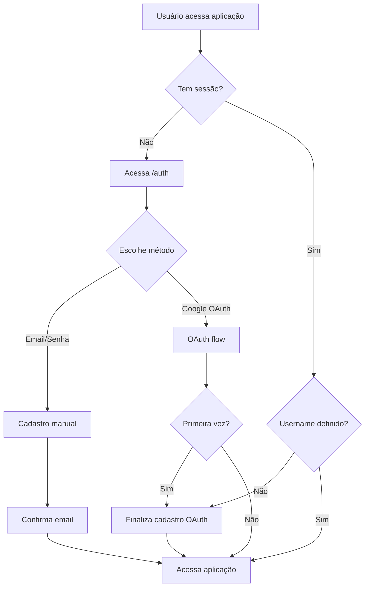
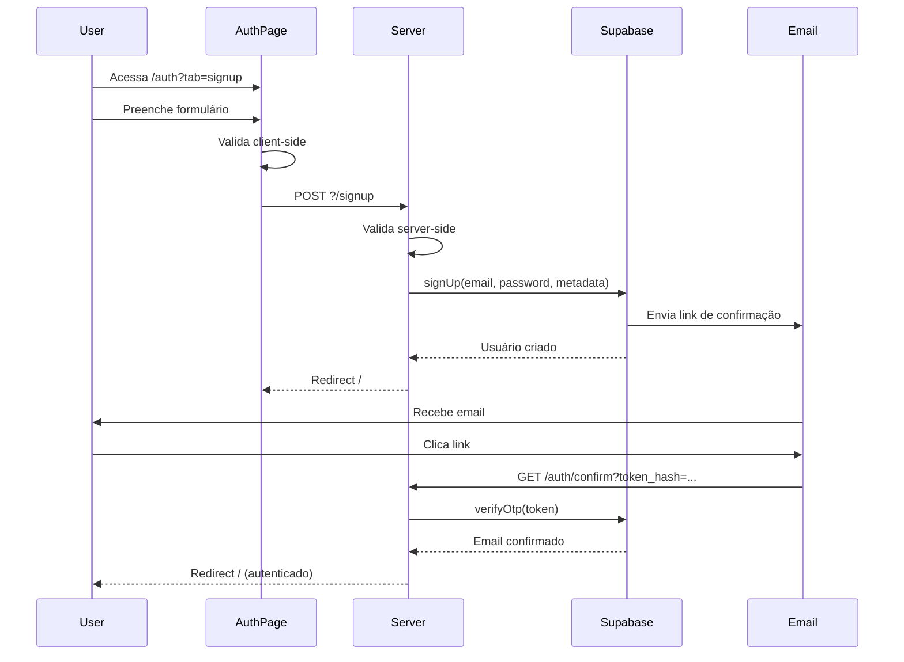
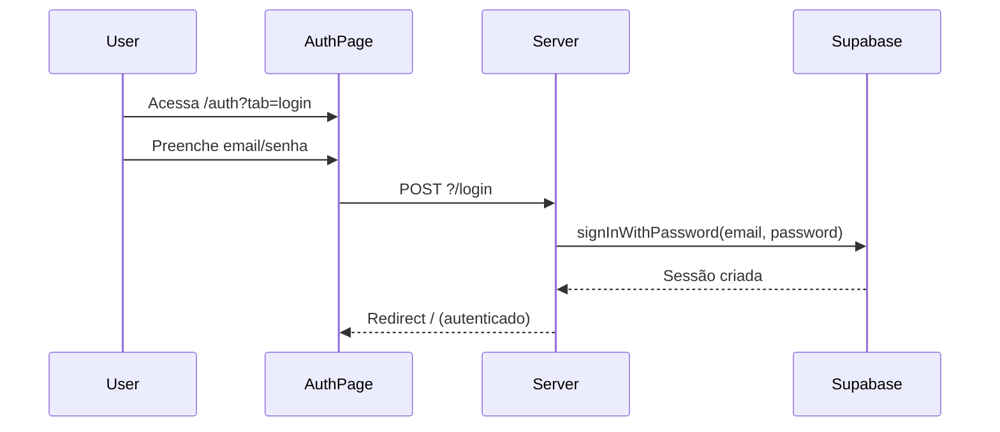
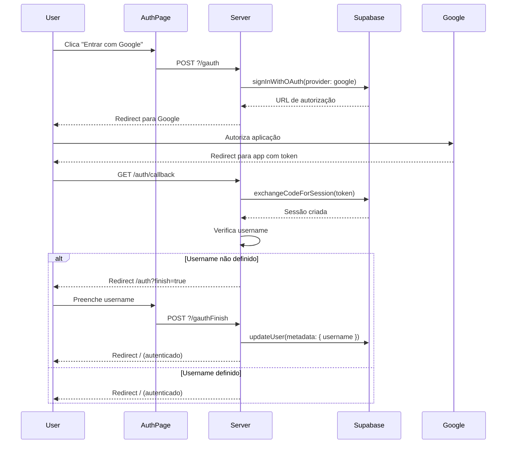
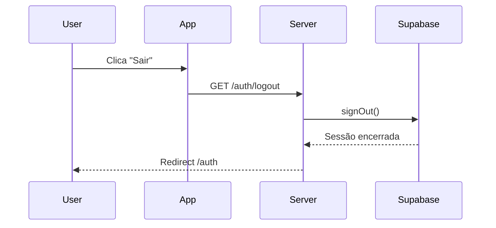
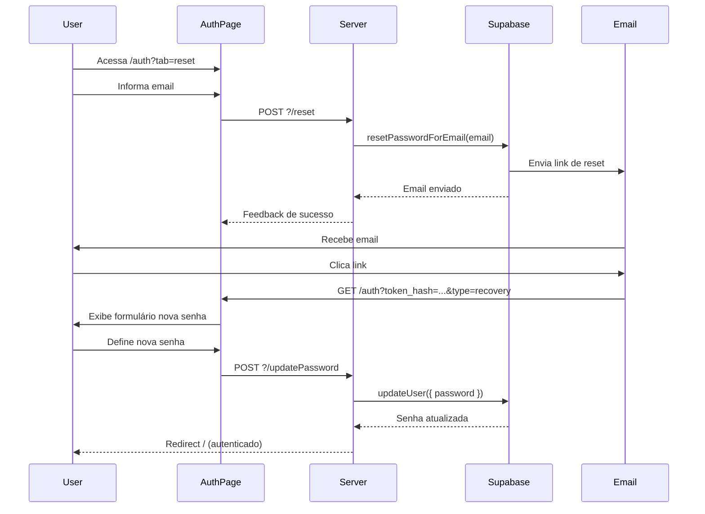
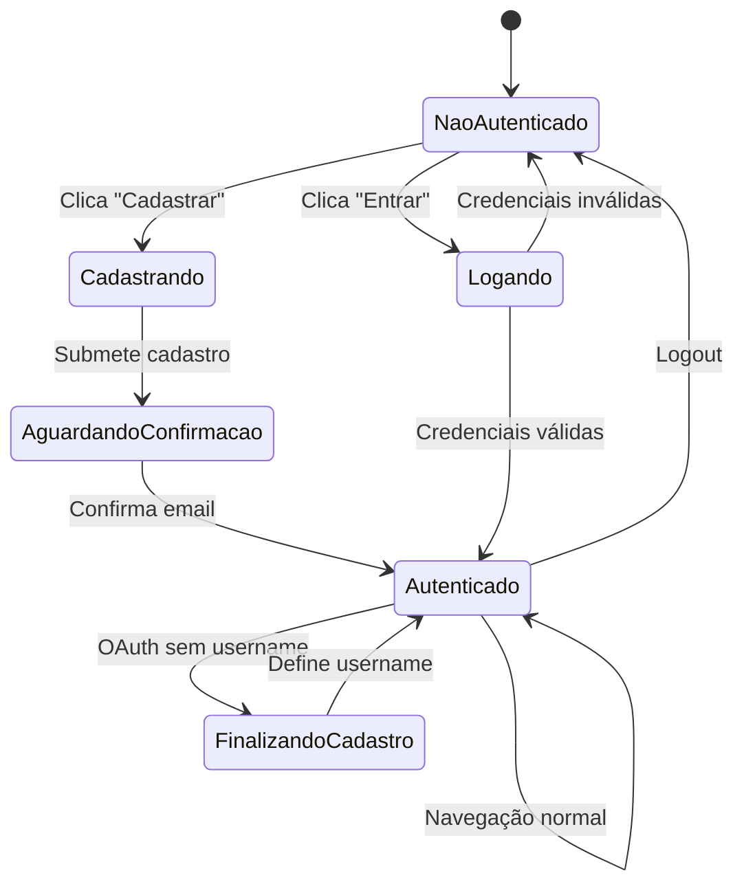

# Autenticação e Autorização

## Estrutura de Arquivos

```
src/routes/auth/
├── +page.server.ts           # Actions de autenticação (signup, login, OAuth)
├── +page.svelte              # Interface de login/cadastro/recuperação
├── +page.ts                  # Load client-side
├── confirm/
│   └── +server.ts            # Confirmação de email via token OTP
├── logout/
│   └── +server.ts            # Logout e limpeza de sessão
└── error/
    └── +page.svelte          # Página de erro de autenticação

src/
├── hooks.server.ts            # Middleware de sessão e guards de rota
├── routes/
│   ├── +layout.server.ts     # Disponibiliza sessão para todas as páginas
│   └── +layout.ts            # Cria cliente Supabase e gerencia auth state
└── app.d.ts                  # Tipos globais de sessão e usuário
```

---

## Fluxo de Autenticação



---

## Componentes Principais

### 1. +page.server.ts (Auth)

Backend de autenticação com múltiplas actions via Supabase Auth:

- **signup**: Cadastro com email, senha e username
- **login**: Login com email e senha
- **gauth**: Autenticação via Google OAuth
- **gauthFinish**: Finalização de cadastro OAuth (adiciona username)

#### Action: signup

Cadastro de novo usuário com validações server-side.

**Validações**:

- Email: formato válido via regex
- Username: apenas letras, números e underscores (pelo menos uma letra)
- Senha: mínimo 6 caracteres
- Confirmação: senhas devem coincidir
- Campos obrigatórios: todos

**Comportamento**:

- Erros de validação: redirect para `/auth?tab=signup&error=...&form=...`
- Sucesso: Supabase envia email de confirmação, redirect para `/`
- Usuário criado com metadados: `{ username, role: 'user' }`

---

#### Action: login

Login de usuário existente via `signInWithPassword()`.

**Comportamento**:

- Credenciais inválidas: redirect para `/auth?tab=login&error=...`
- Sucesso: cria sessão, redirect para `/`

---

#### Action: gauth

Autenticação via Google OAuth com `signInWithOAuth()`.

**Comportamento**:

- Redirect para página de autorização do Google
- Callback retorna para aplicação com token
- Se primeira vez: redirect para finalização de cadastro
- Se já cadastrado: login automático

---

#### Action: gauthFinish

Finalização de cadastro OAuth (adiciona username).

**Comportamento**:

- Atualiza username na tabela `user` via Supabase query
- Atualiza metadados do auth via `updateUser()`
- Operações paralelas com Promise.all
- Erros: redirect para `/auth?error=...&finish=true`
- Sucesso: redirect para `/`

---

### 2. +page.svelte (Auth)

Interface principal de autenticação com tabs dinâmicas controladas por query param `?tab=`:

- **login**: Formulário de login (padrão)
- **signup**: Formulário de cadastro
- **reset**: Recuperação de senha
- **finish**: Finalização de cadastro OAuth

#### Tab: Login

**Recursos**:

- Login manual via email/senha
- Login social via Google OAuth (botão estilizado com gradient)
- Link "Esqueci minha senha" para tab reset
- Link "Cadastre-se" para tab signup
- Alertas de erro via `data.error`

---

#### Tab: Signup

**Recursos**:

- Cadastro manual com email, username e senha
- Cadastro social via Google OAuth
- Validação client-side em tempo real:
  - Senha mínima 6 caracteres (feedback visual)
  - Senhas coincidem (feedback visual)
  - Username com regex (apenas letras, números, underscore)
- Avatar circular com primeira letra do username
- Link "Já tem conta?" para tab login
- Preservação de campos após erro via `data.form`
- Botão disabled até validação completa

---

#### Tab: Reset

**Recursos**:

- Campo de email para recuperação
- Link "Voltar ao login" para tab login
- Supabase envia email com link de reset

---

#### Tab: Finish (OAuth)

**Recursos**:

- Exibe email do usuário OAuth (campo desabilitado)
- Campo de username obrigatório
- Avatar circular com primeira letra
- Executado apenas após login OAuth sem username definido

---

### 3. confirm/+server.ts

Endpoint de confirmação de email via token OTP enviado por email.

**Comportamento**:

- Recebe `token_hash` e `type` via URL query params
- Valida token via `verifyOtp()`
- Sucesso: ativa conta e redirect para `/`
- Erro: redirect para `/auth/error`

---

### 4. logout/+server.ts

Endpoint de logout e limpeza de sessão.

**Comportamento**:

- Encerra sessão via `signOut()`
- Limpa cookies de autenticação automaticamente
- Redirect para `/auth`

---

### 5. error/+page.svelte

Página simples de erro de autenticação exibida em falhas de confirmação de email ou erros críticos.

---

## Sistema de Sessões

### 6. hooks.server.ts

Middleware global para autenticação e autorização com dois handlers sequenciais.

#### Handle: supabase

Cria cliente Supabase server-side por requisição:

- Cliente Supabase isolado por requisição
- Sincronização automática de cookies via `getAll()` e `setAll()`
- `safeGetSession()`: valida JWT via `getUser()` antes de retornar sessão

**Função `safeGetSession()`**: Diferente de `getSession()` que apenas lê o cookie, esta função também valida o JWT chamando `getUser()`, garantindo que a sessão é válida e não expirada.

---

#### Handle: authGuard

Guard de autenticação para rotas protegidas via array de regras.

**Rotas protegidas**:

- `/private` (gerenciamento de perfil)
- `/objetos?new` (criação de objeto)

**Regras de redirecionamento**:

1. **Sem sessão + rota protegida**: redirect para `/auth`
2. **Com sessão + sem username + não é /auth**: redirect para `/auth` (finalizar OAuth)
3. **Com sessão + com username + em /auth**: redirect para `/` (já autenticado)

---

### 7. +layout.server.ts

Disponibiliza sessão para todas as páginas via load function.

**Comportamento**:

- Executa em toda requisição server-side
- Valida JWT via `safeGetSession()`
- Disponibiliza `session` para todos os componentes

---

### 8. +layout.ts

Cria cliente Supabase apropriado (browser ou server) e gerencia estado de autenticação.

**Recursos**:

- Cliente Supabase adaptativo via `isBrowser()`
- Browser: `createBrowserClient()` (singleton)
- Server: `createServerClient()` (por requisição)
- Invalidação via `depends('supabase:auth')`
- Disponibiliza `supabase`, `session` e `user` globalmente
- Monitora mudanças de auth state no +layout.svelte via `onAuthStateChange()`

---

### 9. app.d.ts

Tipos globais TypeScript para sessão e usuário em `App.Locals` e `App.PageData`.

---

## Fluxos Detalhados

### Cadastro Manual (Email/Senha)



---

### Login Manual



---

### OAuth (Google)



---

### Logout



---

### Recuperação de Senha



---

## Estados e Transições



---

## Validações

### Client-side:

- Email: formato via binding reativo
- Username: regex visual (letras, números, underscore)
- Senha: mínimo 6 caracteres (feedback visual em tempo real)
- Confirmação: senhas coincidem (feedback visual em tempo real)
- Botão disabled até validação completa

### Server-side:

- Email: regex `/^[^\s@]+@[^\s@]+\.[^\s@]+$/`
- Username: regex `/^(?=.*[a-zA-Z])[a-zA-Z0-9_]+$/` (pelo menos uma letra)
- Senha: mínimo 6 caracteres
- Confirmação: comparação exata
- Campos obrigatórios: todos

---

## Tratamento de Erros e Feedback

### Erros:

- Validação client-side: feedback visual inline (texto vermelho, Label colorido)
- Validação server-side: redirect com `error` query param
- Erros Supabase: exibidos em Alert dismissable do Flowbite
- Campos preservados: via `form` query param (base64 encoded via `stringToBase64URL`)
- Múltiplos erros: concatenados com `; ` no query param

### Feedback:

- Alertas coloridos (vermelho para erro)
- Mensagens contextuais por campo
- Preservação de dados após erro
- Estados loading durante submit
- Avatar dinâmico com primeira letra do username

---

## Segurança

### Autenticação:

- JWT via Supabase Auth
- Validação de token em toda requisição via `safeGetSession()`
- Cookies HttpOnly e Secure automaticamente
- CSRF protection via SvelteKit
- Rate limiting no Supabase (configurado no dashboard)

### Autorização:

- Guards de rota via middleware (`authGuard`)
- Validação de username obrigatório para acesso completo
- Rotas protegidas configuráveis via array de regras
- Row Level Security (RLS) no banco de dados Supabase

### Dados:

- Senhas hashadas pelo Supabase (bcrypt)
- Tokens OTP com expiração (24h para confirmação, 1h para reset)
- Sanitização de inputs via validações
- Proteção contra XSS e SQL Injection via Supabase

---

## Performance

### Otimizações:

- Cliente Supabase reutilizado (singleton no browser)
- Validação JWT cacheada durante requisição via `event.locals`
- Cookies configurados com `path: /` (evita duplicação)
- Operações paralelas com Promise.all (gauthFinish)

### Caching:

- Sessão cacheada em `event.locals` durante requisição
- Cliente browser mantém sessão em memória
- Revalidação automática via `depends('supabase:auth')`
- Monitoramento de mudanças via `onAuthStateChange()` no +layout.svelte

---

## Acessibilidade

- Labels em todos os campos de formulário
- Feedback visual e textual de erros
- Navegação via teclado (Tab, Enter)
- Foco visível em campos ativos
- Contraste adequado em modo claro/escuro via Tailwind
- Alertas com role="alert" implícito (Flowbite Alert)
- Placeholders descritivos

---

## Integrações

### Supabase Auth:

- Email/Password provider
- Google OAuth provider (configurado via dashboard)
- Email confirmação automática via templates
- Password reset via email
- JWT tokens com refresh automático
- Row Level Security (RLS) para isolamento de dados

### Supabase Database:

- Tabela `user` sincronizada via trigger no banco
- Metadados de auth (`user_metadata`) incluem username e role
- Role sempre `user` (sem admin/funcionário)

---

## Melhorias Futuras

- [ ] Autenticação via outros providers (GitHub, Apple)
- [ ] Two-factor authentication (2FA)
- [ ] Login passwordless (magic link)
- [ ] Histórico de sessões ativas
- [ ] Notificação de login em novo dispositivo
- [ ] Sessões com TTL configurável
