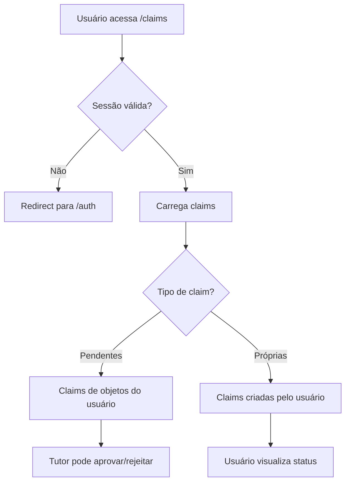
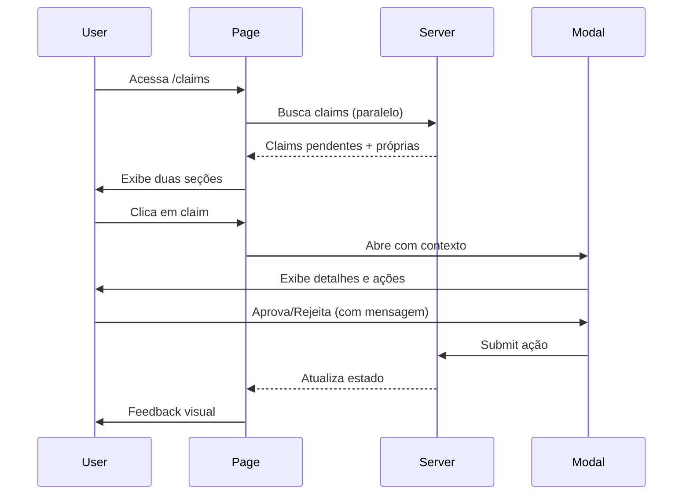
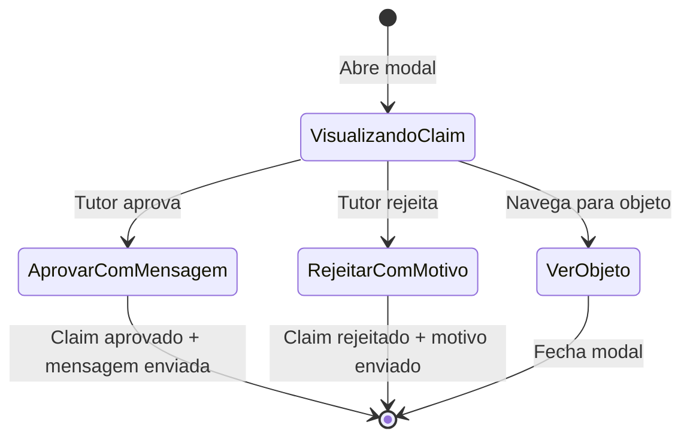
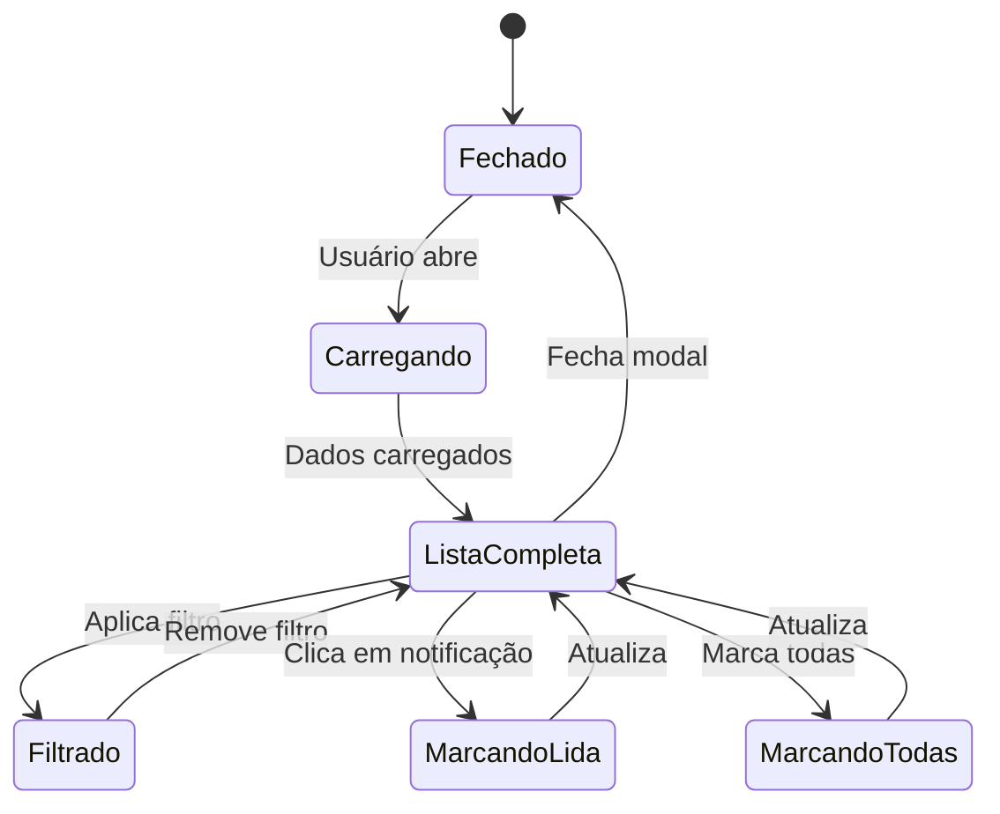
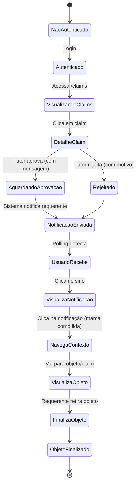

# Gerenciamento de Reivindicações e Notificações

## Estrutura de Arquivos

```
src/routes/claims/
├── +page.server.ts           # Backend para listagem e ações de claims
├── +page.svelte               # Interface principal de visualização de claims
├── ClaimCard.svelte           # Card individual de reivindicação
├── ClaimModal.svelte          # Modal de detalhes e aprovação/rejeição
├── ClaimsSection.svelte       # Seção agrupadora de claims
└── types.ts                   # Tipos e utilitários para claims

src/routes/objetos/
├── ObjetoModalClaim.svelte    # Modal para criar nova reivindicação
└── [id]/
    └── +page.svelte           # Página de detalhes com botão de claim

src/lib/api/
├── api.ts                     # Funções de API para claims (postClaim, approveClaim, rejectClaim)
└── notifications.ts           # Funções de API para notificações

src/lib/stores/
└── notifications.ts           # Store Svelte para gerenciamento de estado

src/lib/components/
├── NotificationModal.svelte   # Modal de visualização de notificações
├── NotificationPoller.svelte  # Polling automático de notificações
├── NotificationHamburger.svelte # Ícone de notificações no header
├── NotificationToast.svelte   # Toast de notificação instantânea
└── NotificationContainer.svelte # Container para toasts
```

---

## Fluxo de Autenticação e Autorização



---

## Componentes Principais

### 1. +page.server.ts (Claims)

Backend responsável por buscar e processar reivindicações com enriquecimento de dados:

- Busca paralela de claims pendentes (tutor) e claims do usuário
- Enriquecimento: adiciona dados completos do objeto associado via `getObjetosByIds()`
- Actions: `approveClaim` e `rejectClaim` para tutores
- Paginação: suporta parâmetros `page` e `size`
- Autenticação obrigatória com redirecionamento automático

#### Função de enriquecimento:

```typescript
async function enrichClaimsWithObjetos(claims: any) {
  const objetoIds = claims.items.map((claim: any) => claim.objeto_id);
  const objetos = await getObjetosByIds(objetoIds);
  const objetosMap = new Map(objetos.map((obj) => [obj.id, obj]));

  claims.items = claims.items.map((claim: any) => ({
    ...claim,
    objeto: objetosMap.get(claim.objeto_id)
  }));

  return claims;
}
```

#### Actions do servidor:

**approveClaim**: Tutor do objeto aprova a reivindicação, incluindo mensagem de feedback para o requerente. Após aprovação, o objeto muda para status `aguardando_retirada`, permitindo que o requerente finalize o objeto posteriormente.

**rejectClaim**: Tutor do objeto rejeita a reivindicação, incluindo justificativa textual do motivo da rejeição que será enviada ao requerente.

---

### 2. +page.svelte (Claims)

Interface principal com dois modos de visualização (mobile/desktop) e duas seções:

- **Para Aprovar**: Claims pendentes em objetos tutelados pelo usuário
- **Minhas Reivindicações**: Claims criadas pelo próprio usuário
- Busca assíncrona com Promise.all para carregamento paralelo
- Modal de detalhes com contexto (aprovação ou visualização)
- Alertas de feedback visual para sucesso/erro

#### Workflow de visualização:



---

### 3. ClaimCard.svelte

Card individual para exibição compacta de uma reivindicação:

- Miniatura clicável do objeto (navega para `/objetos/[id]`)
- Informações: nome do objeto, descrição do claim, data
- Badge visual de status (pendente/aprovado/rejeitado)
- Variants mobile/desktop com tamanhos diferentes
- Acessibilidade: role="button", tabindex, keyboard navigation

---

### 4. ClaimModal.svelte

Modal para visualização detalhada e ações de aprovação/rejeição:

- Exibe dados completos do objeto reivindicado com botão de navegação
- Mostra descrição textual fornecida pelo requerente
- Grid de evidências (imagens anexadas)
- Data formatada de criação via `formatDate()`
- Badge de status com cores semânticas via `getStatusBadgeColor()`
- Campo textual para mensagem ao aprovar/rejeitar
- Botões de ação (apenas para tutores e claims pendentes)
- Forms com `use:enhance` para actions `approveClaim` e `rejectClaim`

#### Ações do modal:



---

### 5. ClaimsSection.svelte

Componente de seção reutilizável para agrupar claims:

- Recebe props: title, iconColor, claims, total, emptyMessage
- Suporta snippets para customização de ícones
- Variantes mobile/desktop
- Estado vazio com mensagem personalizada
- Grid responsivo de ClaimCard

---

### 6. ObjetoModalClaim.svelte

Modal para criar nova reivindicação sobre um objeto:

- Formulário com descrição textual obrigatória
- Upload múltiplo de evidências (imagens)
- Preview das imagens anexadas
- Validações client-side
- Submit via `postClaim()` com token de autenticação
- Integrado na página de detalhes do objeto

---

### 7. types.ts (Claims)

Definições de tipos e funções utilitárias:

```typescript
type ClaimStatus = 'pendente' | 'aprovado' | 'rejeitado' | 'PENDENTE' | 'APROVADO' | 'REJEITADO';

type Claim = {
  id: string;
  objeto_id: string;
  descricao: string;
  evidencias: string[];
  data_registro: string;
  status: ClaimStatus;
  user_id: string;
  tutor_id: string;
  objeto?: Objeto;
};
```

#### Funções utilitárias:

- `formatDate()`: Formata timestamp para exibição em português
- `getStatusBadgeColor()`: Retorna cor do badge baseado no status
- `getStatusText()`: Normaliza e traduz texto do status

---

## Sistema de Notificações

### 8. notifications.ts (Store)

Store Svelte para gerenciamento reativo de notificações:

- `notifications`: Store principal com todas as notificações
- `unreadNotifications`: Derivado filtrando não lidas
- `unreadCount`: Derivado contando não lidas
- `recentNotifications`: Derivado com últimas 10

#### Actions disponíveis:

```typescript
notificationActions = {
  addNotification(notification)      // Adiciona nova (evita duplicatas)
  markAsRead(notificationId)         // Marca individual como lida
  markAllAsRead()                    // Marca todas como lidas
  removeNotification(notificationId) // Remove específica
  clearAll()                         // Limpa todas
  clearOldNotifications()            // Remove > 30 dias
}
```

**Persistência**: Salva automaticamente no localStorage (apenas no browser)

---

### 9. notifications.ts (API)

Funções de comunicação com a API de notificações:

```typescript
interface Notification {
  id: string;
  message: string;
  user_id: string;
  created_at: string;
  delivered: boolean;
}
```

#### Funções:

- `getNotifications()`: Lista notificações com paginação
- `markNotificationAsRead()`: Marca individual como lida via PUT
- `markAllNotificationsAsRead()`: Marca todas como lidas via PUT

**URL base**: `/notifys` (endpoint da API)

---

### 10. NotificationModal.svelte

Modal principal para visualização e gerenciamento de notificações:

- Lista ordenada cronologicamente (mais recentes primeiro)
- Filtro: mostrar todas ou apenas não lidas
- Contadores: total e não lidas via `$unreadCount`
- Botão "Marcar todas como lidas"
- Timestamp relativo (há X minutos/horas/dias) via `formatTimestamp()`
- Scroll infinito com max-height
- Estados: loading, vazio, lista
- Busca automática ao abrir modal via `$effect()`

#### Funcionalidades:



**Notificações clicáveis**: Cada notificação contém link para o objeto ou claim relacionado. Ao clicar, o usuário navega diretamente para o contexto e a notificação é marcada como lida automaticamente.

---

### 11. NotificationPoller.svelte

Componente invisível para polling automático de notificações:

- Executa em background enquanto usuário está logado
- Intervalo: 30 segundos (`POLL_INTERVAL_MS`)
- Sincronização inteligente: mescla notificações servidor/local
- Atualiza store mantendo notificações locais
- Ordena por data e limita a 50 mais recentes
- Cleanup automático ao desmontar ou logout via `onDestroy()`

#### Lógica de sincronização:

```typescript
// Atualiza existentes
const updated = current.map((n) => serverMap.get(n.id) || n);

// Adiciona novas
const newNotifications = serverNotifications.filter((n) => !currentMap.has(n.id));

// Combina e limita
return [...updated, ...newNotifications].sort((a, b) => new Date(b.created_at) - new Date(a.created_at)).slice(0, 50);
```

---

### 12. NotificationHamburger.svelte

Ícone de notificações no header da aplicação:

- Ícone de sino com badge de contagem
- Badge vermelho mostra número de não lidas via `$unreadCount`
- Animação sutil ao receber novas
- Clique abre NotificationModal
- Integrado no componente Header

---

### 13. NotificationToast.svelte

Toast para exibição instantânea de novas notificações:

- Aparece no canto da tela
- Auto-fecha após alguns segundos
- Clique navega para contexto e marca como lida
- Botão de fechar manual

---

### 14. NotificationContainer.svelte

Container para gerenciar múltiplos toasts simultaneamente:

- Empilha toasts verticalmente
- Gerencia animações de entrada/saída
- Limita quantidade visível

---

## Integração Global

### 15. +layout.svelte

Layout raiz da aplicação que integra o sistema de notificações:

```svelte
<!-- Polling automático (apenas usuários autenticados) -->
{#if data.session}
  <NotificationPoller session={data.session} />
{/if}

<!-- Modal de notificações -->
<NotificationModal bind:open={openNotifys} session={data.session} />
```

**Fluxo completo**:

1. Usuário loga → NotificationPoller inicia
2. Polling busca notificações a cada 30s
3. Novas notificações atualizam store
4. Badge no header reflete contagem
5. Usuário clica no sino → Modal abre
6. Usuário clica em notificação → Navega para contexto + marca como lida

---

## Estrutura de Dados

### Claim (API)

```json
{
  "id": "uuid",
  "objeto_id": "uuid",
  "descricao": "Perdi este item ontem...",
  "evidencias": ["https://url-evidencia-1.jpg", "https://url-evidencia-2.jpg"],
  "data_registro": "2025-11-08T15:30:00Z",
  "status": "pendente",
  "user_id": "uuid",
  "tutor_id": "uuid",
  "mensagem_resposta": "Objeto aguardando retirada na portaria",
  "objeto": {
    "id": "uuid",
    "nome": "Carteira marrom",
    "descricao": "Carteira de couro",
    "url_imagem": "https://url-imagem.jpg",
    "status": "aguardando_retirada"
  }
}
```

### Notification (API)

```json
{
  "id": "uuid",
  "message": "Sua reivindicação foi aprovada!",
  "user_id": "uuid",
  "created_at": "2025-11-08T15:30:00Z",
  "delivered": false
}
```

---

## Estados e Fluxos da Aplicação



---

## Validações

### Claims:

- Descrição: mínimo 10 caracteres
- Evidências: opcional, múltiplas imagens permitidas
- Autorização: apenas objetos com status "aberto"
- Mensagem resposta: obrigatória ao aprovar/rejeitar

### Notificações:

- Mensagem: string não vazia
- Usuário: deve existir e estar ativo
- Delivered: booleano para controle de leitura

---

## Tratamento de Erros e Feedback

### Claims:

- Erro ao buscar: Retorna lista vazia, exibe alerta
- Erro ao aprovar/rejeitar: Mantém estado, mostra mensagem de erro
- Campos preservados após erro de submit
- Alertas visuais com componentes Alert do Flowbite

### Notificações:

- Falha no polling: Log silencioso, retry no próximo ciclo
- Erro ao marcar lida: Alert para usuário, mantém tentativa
- Falha na sincronização: Mantém versão local
- Persistência: Fallback se localStorage falhar

---

## Segurança

### Claims:

- Autenticação JWT obrigatória via Supabase Auth
- Autorização: apenas tutor pode aprovar/rejeitar
- Validações server-side em actions
- Sanitização de inputs (descrição, evidências)
- Token de sessão validado em cada request

### Notificações:

- Token de sessão validado em cada request
- Notificações filtradas por user_id
- Proteção contra XSS em mensagens
- Não expõe dados sensíveis de outros usuários

---

## Acessibilidade

### Claims:

- Labels ARIA em todos os botões e ícones
- Navegação completa via teclado (Tab, Enter, Esc)
- Focus visível em elementos interativos
- Contraste adequado em modo claro/escuro
- Textos alternativos em imagens via ImageLoader
- Screen reader friendly

### Notificações:

- Contador legível por screen readers
- Modal com foco gerenciado
- Esc fecha modais
- Badges com cores semânticas
- Timestamps em formato legível

---

## Performance

### Claims:

- Busca paralela com Promise.all
- Enriquecimento em batch (evita N+1)
- Paginação para grandes volumes
- Imagens com lazy loading via ImageLoader

### Notificações:

- Polling inteligente (apenas quando necessário)
- localStorage para persistência local
- Limite de 50 notificações em memória
- Limpeza automática de antigas (>30 dias)
- Sincronização incremental

---

## API (unifinder-api)

### Endpoints de Claims:

- `POST /claims` - Criar reivindicação
- `GET /claims/pending` - Claims pendentes (tutor)
- `GET /claims/me` - Minhas claims (reivindicador)
- `PUT /claims/{id}/aprovar` - Aprovar claim
- `PUT /claims/{id}/rejeitar` - Rejeitar claim

### Endpoints de Notificações:

- `GET /notifys` - Listar notificações
- `PUT /notifys/{id}/mark-as-read` - Marcar como lida
- `PUT /notifys/mark-all-as-read` - Marcar todas como lidas

### Endpoints de Objetos:

- `GET /objetos` - Listar objetos com filtros
- `GET /objetos/{id}` - Detalhes de um objeto
- `PUT /objetos/{id}/finalizar` - Finalizar objeto

---

## Melhorias Futuras

- [ ] WebSocket para notificações em tempo real
- [ ] Push notifications via Service Worker
- [ ] Filtros de claims por data e status
- [ ] Histórico completo de ações em claims
- [ ] Notificações agrupadas por contexto
- [ ] Sistema de reputação baseado em claims
- [ ] Chat entre tutor e requerente
- [ ] Monitoramento de métricas e logs
