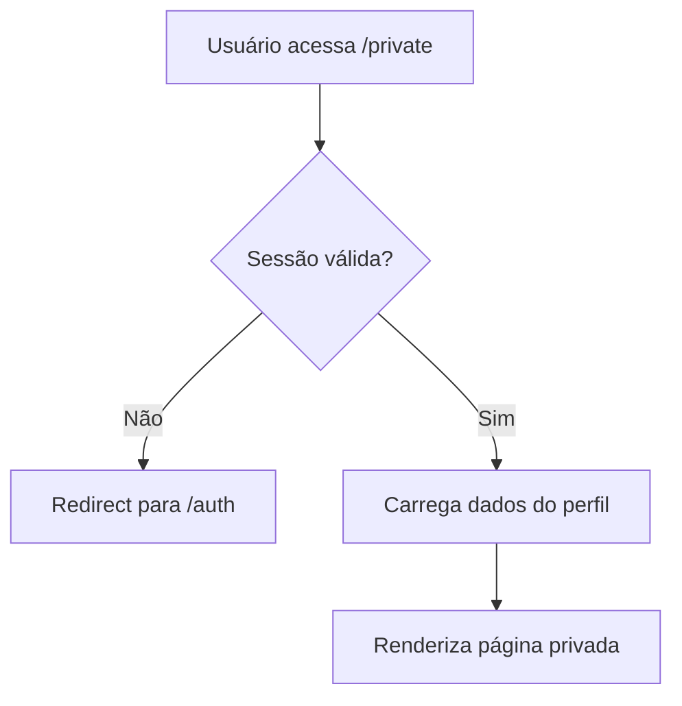
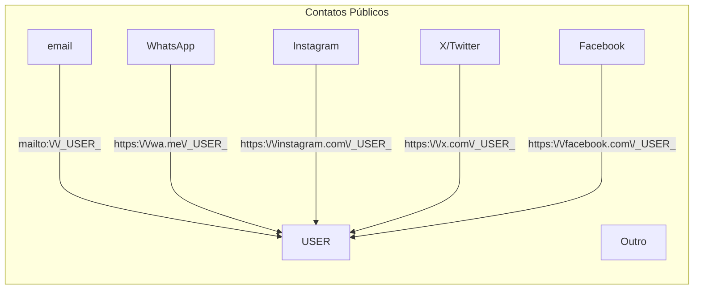
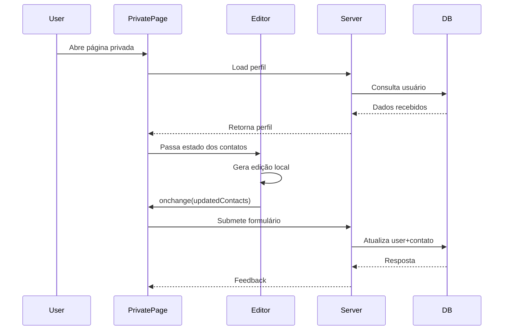
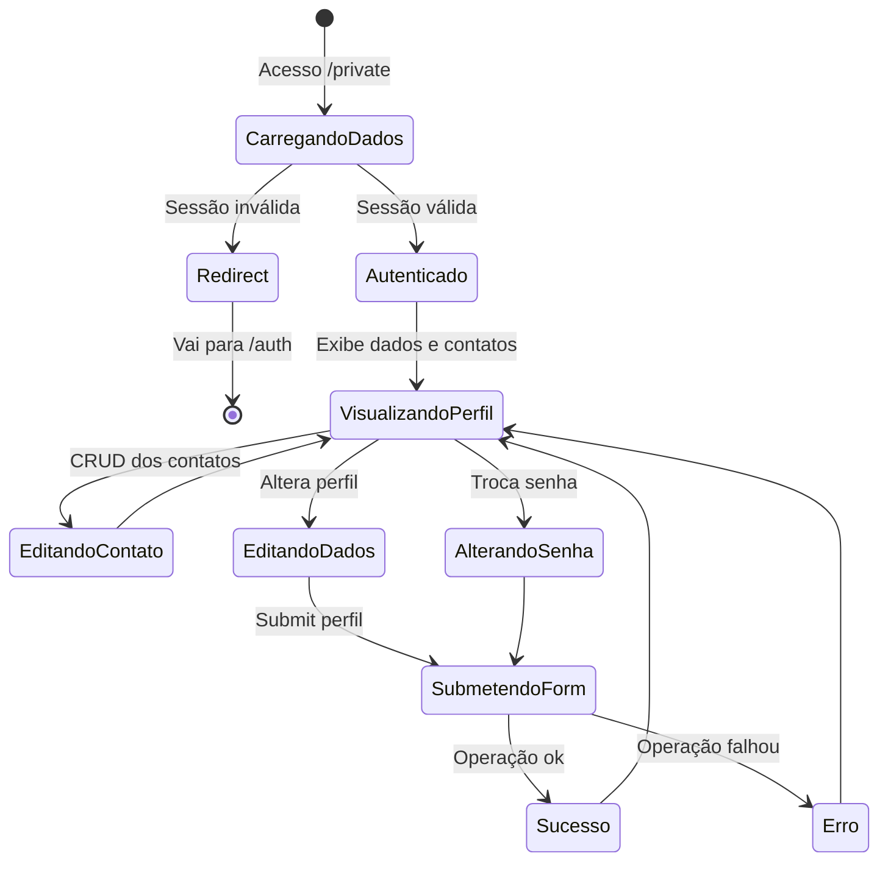

# Gerenciamento de Perfil

## Estrutura de Arquivos

```
components/
└── Profile.svelte         # Exibição pública do perfil e contatos
routes/private/
├── +page.svelte           # Interface do perfil privado/editável
├── +page.server.ts        # Backend e validações do perfil privado
└── ContactsEditor.svelte  # Edição de contatos/redes sociais do usuário
```

---

## Fluxo de Autenticação



---

## Componentes Principais

### 1. Profile.svelte

Componente para exibição pública dos dados do usuário e seus contatos sociais:

- Exibe nome, usuário (`username`) e lista de contatos/links sociais.
- Mostra ícones e rótulos personalizados por tipo de contato.
- Botão para copiar valor do contato para a área de transferência.
- Botão para abrir contato/link externo em nova aba.
- Indicação visual de sucesso ao copiar.
- Modal (popup) para navegação e fechamento.

#### Estrutura dos contatos:

```typescript
interface Contact {
  id: string; // UUID único para identificação
  tipo: string; // Tipo do contato: email, whatsapp, instagram, facebook, x, outro
  valor: string; // Valor público do contato
}
```

#### Composição de url para contatos sociais:



#### Principais recursos do componente:

- Responsivo, com truncate para dados longos;
- Permite múltiplos contatos do mesmo tipo;
- Copia segura com feedback visual via ícone.
- Configuração centralizada para tipos e URLs sociais.

---

### 2. +page.svelte

Integra a edição e visualização dos dados do usuário:

- Tabs: Informações Pessoais / Segurança
- Campos editáveis: username, nome
- Email exibido apenas para leitura
- Editor visual de contatos sociais (interno) via `ContactsEditor.svelte`
- Feedback instantâneo (alertas de sucesso e erro)

#### Workflow de edição



---

### 3. ContactsEditor.svelte

Editor exclusivo para CRUD de contatos sociais:

- Adicionar contato: Seleção de tipo e valor, com geração automática de UUID
- Editar contato: Modo inline; salvar/cancelar edição
- Remover contato: Exclusão direta
- Controle reativo: evita sobreposição entre dados externos e mudanças locais
- Sincronização com parent via callback

#### Estrutura dos contatos

```typescript
interface Contact {
  id: string;
  tipo: string;
  valor: string;
}
```

## Estrutura de Dados no Banco (JSONB)

```json
[
  {
    "id": "550e8400-e29b-41d4-a716-446655440000",
    "tipo": "email",
    "valor": "usuario@email.com"
  },
  {
    "id": "550e8400-e29b-41d4-a716-446655440001",
    "tipo": "whatsapp",
    "valor": "5511999999999"
  }
]
```

---

## Estados e Fluxos da Aplicação



---

## Validações

- Username: mínimo 3 caracteres
- Nome: mínimo 2 caracteres
- Senha: mínimo 6 caracteres
- Confirmação de senha obrigatória
- Contato deve ter `{ id, tipo, valor }` com tipos permitidos

## Tratamento de Erros e Feedback

- Alertas visuais para sucesso ou erro
- Campos preservados após erro
- Spinners durante submit e loading

## Segurança

- Autenticação obrigatória
- Validações client/server
- Sanitização de dados recebidos
- Acesso somente ao próprio usuário
- Proteção CSRF/Injection/XSS

## Acessibilidade

- Labels ARIA nos ícones e botões
- Entrada e navegação via teclado (inclusive edição inline)
- Contraste de cores adequado para modo escuro e claro

## Melhorias Futuras

- [ ] Upload de avatar personalizado
- [ ] Histórico de alteração do perfil
- [ ] Exportação/backup do perfil
- [ ] Cache e lazy loading de dados
- [ ] Suporte a Service Worker/offline

## Testes para serem implementados

- [ ] Redirecionamento do usuário não logado
- [ ] Fluxo completo de edição do perfil
- [ ] CRUD dos contatos
- [ ] Validação e feedback do formulário
- [ ] Funcionamento em telas/mobile
- [ ] Acessibilidade dos controles de contato
